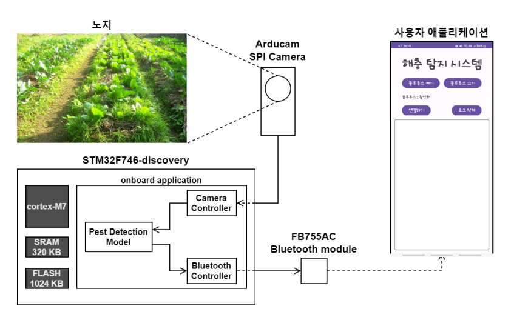

### 1. 프로젝트 소개

본 과제에서는 위의 문제점을 해결하기 위한 방법으로 TinyML을 사용하였다. TinyML이란 소형 저전력 디바이스(주로 마이크로컨트롤러 레벨)에서 실행하는 머신 러닝 모델, 혹은 해당 모델을 사용하는 시스템을 지칭한다. 이미지 정보를 마이크로컨트롤러에 연결된 카메라 디바이스에서 전달받은 뒤, 이미지 전송 과정 없이 마이크로컨트롤러에서 바로 추론 과정을 실행하여 사물을 인식하고, 사물이 인식된 상황에 대해 처리하는 시스템을 구현하는 것이 목표이다.

### 2. 팀 소개

|[신동욱](https://github.com/dntks1942)|[손재성](https://github.com/JS970)|[이상원](https://github.com/leesw9907)|
|:-:|:-:|:-:|
||||
| 데이터 전처리 수행  모델 생성, 학습, 테스트   모델 양자화 및 경량화 | STM 프로잭트 환경 구축    TLFM 라이브러리 적용   모델 입 출력 텐서 처리 로직 | 애플리케이션 UI   블루투스 연결 구축   애플리케이션 기능 제작|
|dntks1942@pusan.ac.kr|son73097@pusan.ac.kr|psy7190@gmail.com|

### 3. 시스템 구성도

### 4. 소개 및 시연 영상

### 5. 설치 및 사용법

